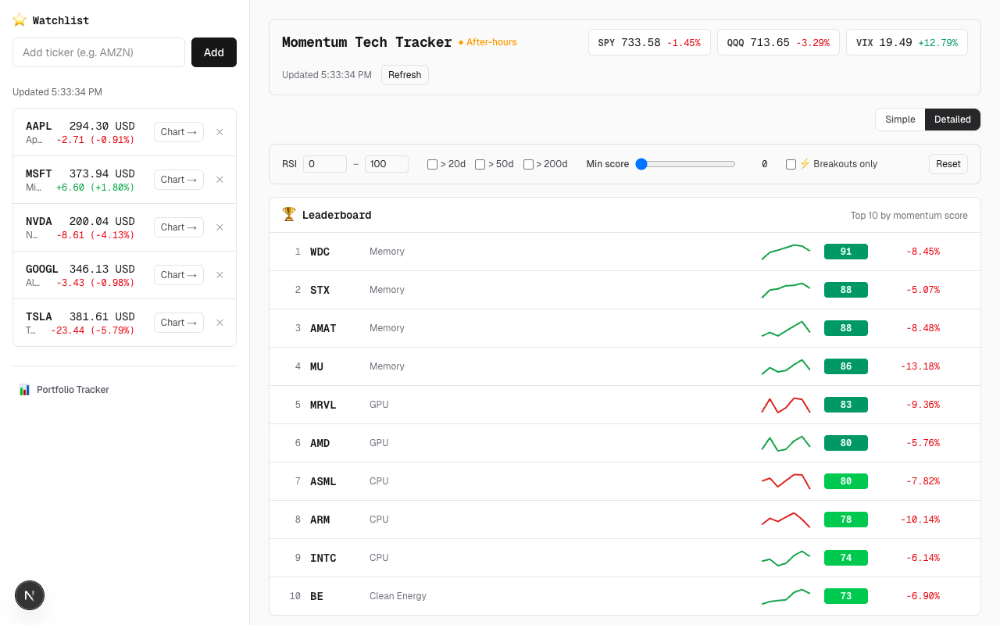

# Finance Tracker

Live momentum scanner and personal watchlist built with Next.js and Yahoo Finance data.



## Features

- **Momentum leaderboard** — ranks stocks by composite score (RSI, MA crossovers, price action); refreshes every 30s
- **Watchlist** — add/remove tickers; persisted in localStorage; sparkline per ticker
- **Market bar** — live SPY, QQQ, VIX at a glance
- **Filters** — RSI range slider, >20d / >50d / >200d MA flags, minimum score threshold, breakout-only mode
- **Simple / Detailed view toggle** — clean summary or full metric breakdown

## Stack

- **Next.js** (App Router) + TypeScript
- **Tailwind CSS**
- **yahoo-finance2** — server-side quote + screener fetching
- **Recharts** — sparklines

## Running locally

```bash
npm install
npm run dev
```

Open [http://localhost:3001](http://localhost:3001).

## API

| Route | Description |
|---|---|
| `GET /api/quote?symbols=AAPL,MSFT` | Live quotes for requested tickers |
| `GET /api/screener` | Momentum leaderboard (sector-grouped, scored) |

## Notes

Yahoo Finance has no official public API — `yahoo-finance2` scrapes their endpoints. Use responsibly. Not investment advice.
